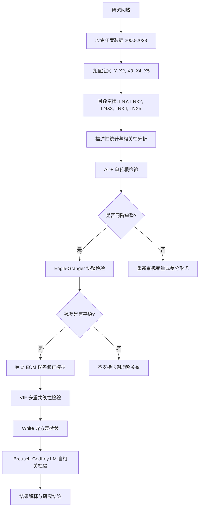

# 研究框架说明

本文档将原报告《贵州茅台净利润模型及实证分析》的研究逻辑整理为可复现的 GitHub 项目流程。

## 1. 研究目标

研究目标是解释贵州茅台净利润的变动来源，并判断净利润与营业收入、营业成本、GDP 增长率和 CPI 之间是否存在长期均衡关系。

核心问题包括：

1. 营业收入是否显著推动净利润增长？
2. 营业成本是否显著压缩净利润增长？
3. GDP 增长率和 CPI 是否对企业利润有明显解释力？
4. 净利润与解释变量之间是否存在协整关系？
5. 当短期利润偏离长期均衡时，是否存在误差修正机制？

## 2. 研究流程

## 3. 为什么不能直接做普通 OLS

年度财务数据和宏观经济变量通常具有趋势性。如果直接对非平稳序列进行 OLS 回归，可能出现较高的 `R^2` 和显著 t 值，但这种关系可能只是共同趋势造成的伪回归。

因此需要先做 ADF 检验，并在存在同阶单整关系时进一步进行协整检验。

## 4. 为什么采用协整和 ECM

长期来看，企业净利润与收入、成本和宏观环境可能存在均衡关系；短期来看，利润增长会受到当期收入增长、成本变化和上一期偏离均衡程度的共同影响。

ECM 同时刻画两类机制：

| 机制 | 模型部分 | 经济含义 |
|---|---|---|
| 长期均衡 | `ECM_{t-1}` | 上一期实际利润与长期均衡利润之间的偏离 |
| 短期波动 | `DLNX2`, `DLNX3`, `DLNX4`, `DLNX5` | 当年收入、成本和宏观变量变化对利润增长的影响 |

若 `ECM_{t-1}` 系数显著为负，说明系统具有回归长期均衡的能力。

## 5. 与原报告结构的对应

| 原报告章节 | GitHub 工程化处理 |
|---|---|
| 一、数据来源 | 整理为 `data/raw/moutai_profit_2000_2023.csv` |
| 二、模型设定 | 公式整理至 `docs/econometric_model_guide.md` |
| 三、模型参数估计与调整 | Python 和 Stata 双实现 |
| ADF 检验 | `src/diagnostics.py` 与 `stata/03_stationarity_cointegration.do` |
| 协整检验 | `src/model.py` 与 `stata/03_stationarity_cointegration.do` |
| ECM | `src/model.py` 与 `stata/04_ecm_diagnostics.do` |
| VIF、White、LM 检验 | `src/diagnostics.py` 与 `stata/04_ecm_diagnostics.do` |
| 研究结果报告 | README 与 docs 文档重写 |

## 6. 可复现原则

本项目按以下原则重构：

1. 数据不隐藏：原始数据以 CSV 形式放入 `data/raw`。
2. 过程可追踪：所有变量生成、回归和检验均由脚本完成。
3. 结果可导出：表格输出到 `outputs/tables`，图形输出到 `outputs/figures`。
4. 双软件实现：Python 用于开源复现，Stata 用于计量课程环境复现。
5. 文档工程化：README、模型说明、假设说明和复现说明分离，便于 GitHub 展示。

## 7. 适用边界

由于样本量只有 24 个年度观测值，模型更适合用于课程实证展示和计量方法练习。若用于严肃预测，建议扩展季度数据或加入更多公司层面、行业层面和政策变量。
